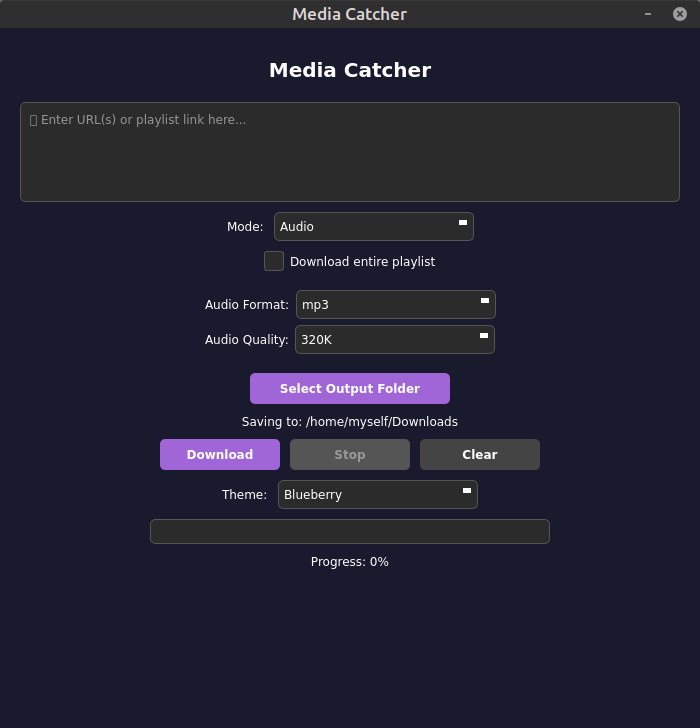
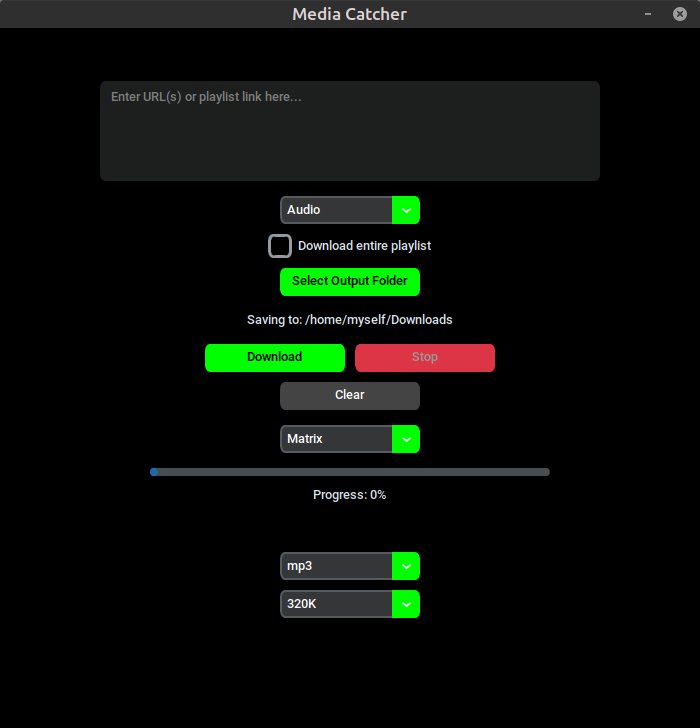
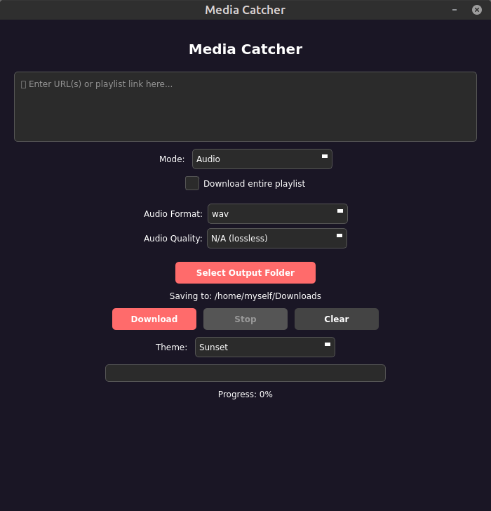
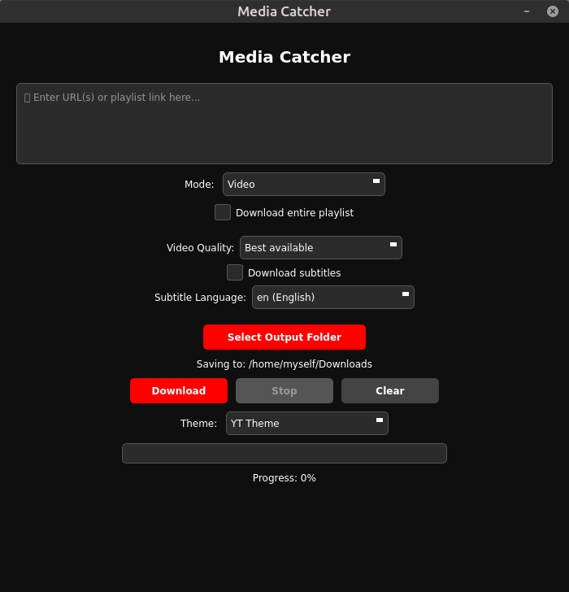

# Media Catcher

Media Catcher is a modern, user-friendly GUI application built on top of yt-dlp that allows you to easily download videos and audio from over 1000 supported platforms and websites. With its intuitive PyQt5 interface and powerful features, downloading media has never been easier.

## ✨ Features

- **Download Videos & Audio** - From over 1000 supported platforms and websites including YouTube, Vimeo, and many more
- **Playlist Support** - Download entire playlists or individual videos with smart playlist detection
- **Multiple Audio Formats** - MP3, WAV, AAC with quality options (64K-320K)
- **Video Quality Selection** - From 240p to 1080p or best available quality
- **Subtitle Download** - Support for multiple languages (English, Slovak, Czech, German, French, Spanish, Russian, Japanese, Chinese)
- **Beautiful Themes** - 6 stunning themes: Blueberry (default), Light, YT Theme, Matrix, Ocean, and Sunset
- **Real-time Progress** - Progress bar with percentage and detailed status updates
- **Stop Function** - Cancel downloads at any time with the Stop button
- **Custom Output Folder** - Save downloads to any location you choose
- **Built with PyQt5** - Modern, responsive cross-platform interface

## 📱 Screenshots





## 📋 Requirements

- Python 3.6+
- yt-dlp
- ffmpeg (for media processing)
- PyQt5

## 🚀 Installation

### Option 1: Install from Flathub (Linux)
```bash
# Coming soon after approval
flatpak install flathub io.github.yourusername.MediaCatcher
flatpak run io.github.yourusername.MediaCatcher
```

### Option 2: Run from Source

1. Clone the repository:
```bash
git clone https://github.com/yourusername/MediaCatcher.git
cd MediaCatcher
```

2. Install dependencies:
```bash
pip install -r requirements.txt
```

3. Make sure ffmpeg is installed:
```bash
# Ubuntu/Debian
sudo apt install ffmpeg

# Fedora
sudo dnf install ffmpeg

# Arch Linux
sudo pacman -S ffmpeg

# macOS
brew install ffmpeg

# Windows
# Download from https://ffmpeg.org/download.html
```

4. Run the application:
```bash
python media-catcher.py
```

## 🎯 Usage

1. **Launch the application**
   ```bash
   flatpak run io.github.yourusername.MediaCatcher  # if installed via Flathub
   # or
   python media-catcher.py  # if running from source
   ```

2. **Enter URLs**
   - Paste one or more video/playlist URLs in the text area
   - Separate multiple URLs with new lines
   - Supports YouTube, Vimeo, and 1000+ other platforms

3. **Choose Download Mode**
   - **Audio**: Downloads audio only in your chosen format
   - **Video**: Downloads video with audio merged

4. **Select Options**
   - For audio: Choose format (MP3/WAV/AAC) and quality (320K/192K/128K/64K)
   - For video: Choose quality (Best/1080p/720p/480p/360p/240p) and optionally enable subtitles
   - Check "Download entire playlist" for playlist URLs

5. **Set Output Folder**
   - Click "Select Output Folder" to choose where to save files
   - Default: ~/Downloads

6. **Start Download**
   - Click "Download" to begin
   - Monitor progress with the progress bar and status messages
   - Use "Stop" button to cancel downloads if needed
   - Use "Clear" button to reset the interface

## 🎨 Themes

Switch between 6 beautiful themes using the dropdown at the bottom:
- **Blueberry**: Modern dark theme with purple accents (default)
- **Light**: Clean light theme with blue accents
- **YT Theme**: YouTube-inspired dark theme with red accents
- **Matrix**: Green on black terminal-style theme
- **Ocean**: GitHub-inspired dark theme with blue accents
- **Sunset**: Warm dark theme with coral accents

## 📁 File Structure

```
MediaCatcher/
├── media-catcher.py      # Main application file
├── themes.json           # Theme configurations
├── media-catcher.svg     # Application icon (SVG)
├── media-catcher.png     # Application icon (PNG)
├── requirements.txt      # Python dependencies
├── LICENSE              # GPL-3.0+ License
├── README.md            # This file
└── screenshots/
    └── main-interface.png
```

## 🛠️ Troubleshooting

**Issue: "No module named 'PyQt5'"**
- Solution: Run `pip install PyQt5`

**Issue: "ffmpeg not found"**
- Solution: Install ffmpeg for your system (see installation section)

**Issue: Download fails**
- Make sure you have internet connection
- Check if the URL is valid and accessible
- Try updating yt-dlp: `pip install --upgrade yt-dlp`

**Issue: GUI doesn't appear**
- Make sure PyQt5 is properly installed
- On Linux: `sudo apt-get install python3-pyqt5`
- Try running with: `QT_QPA_PLATFORM=xcb python media-catcher.py`

**Issue: "Could not load application icon"**
- This is a warning and doesn't affect functionality
- Make sure icon files are in the same directory as the script

## 🤝 Contributing

Contributions are welcome! Please feel free to submit a Pull Request.

1. Fork the repository
2. Create your feature branch (`git checkout -b feature/AmazingFeature`)
3. Commit your changes (`git commit -m 'Add some AmazingFeature'`)
4. Push to the branch (`git push origin feature/AmazingFeature`)
5. Open a Pull Request

## 📄 License

This project is licensed under the GPL-3.0+ License - see the [LICENSE](LICENSE) file for details.

## 🙏 Acknowledgments

- [yt-dlp](https://github.com/yt-dlp/yt-dlp) - The powerful download engine
- [PyQt5](https://riverbankcomputing.com/software/pyqt/) - Cross-platform GUI framework
- [FFmpeg](https://ffmpeg.org/) - Media processing

## ⚠️ Disclaimer

This tool is for educational purposes and personal use only. Please respect copyright laws and the terms of service of the websites you download from. Only download content you have permission to download.

## 📧 Contact

For issues, questions, or suggestions, please open an issue on GitHub.

---

Made with ❤️ by Marek Kožuch
